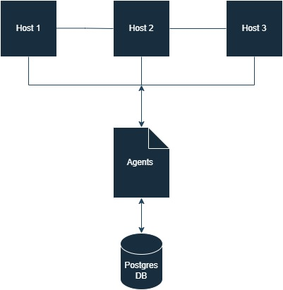
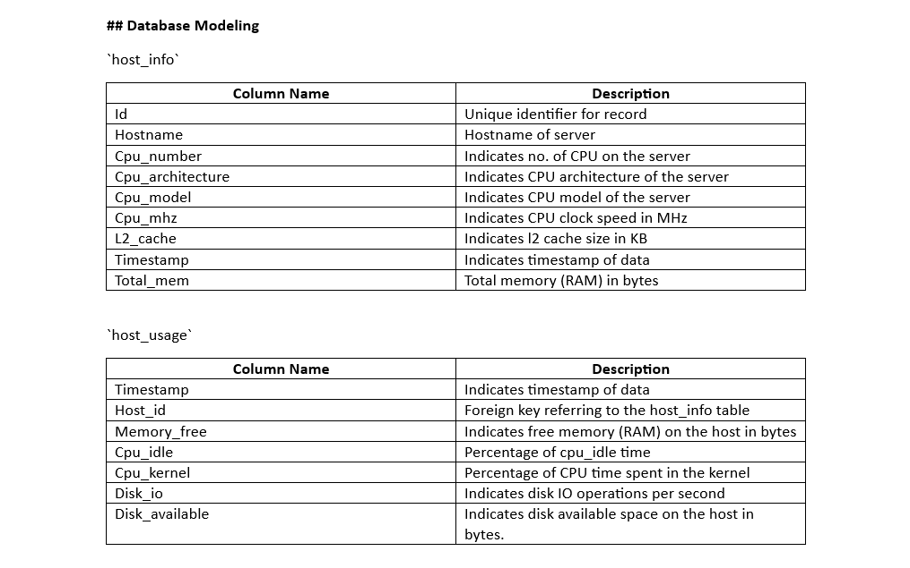

# Introduction

Linux Cluster Administration documents the cluster's hardware specs and resource usage and stores the information in a database for later use by the administrators. The automated scripts are generated using bash and real-time data is stored in the PostgreSQL database.

# Quick Start

```bash 

1 Type ./psql_docker.sh start to start a psql instance using psql_docker.sh 
2 Create host_info tables with columns: id, hostname,cpu_number, cpu_architecture, cpu _model,cpu_mhz,L2_cache,total_mem,timestamp and create host_usage tables with columns: timestamp,host_id,memory_free,cpu_idle,cpu_kernel,disk_io,disk_available
3 To Insert hardware specs data into the DB using host_info.sh type: INSERT INTO host_info (hostname, cpu_number, cpu_architecture, cpu_model, cpu_mhz, l2_cache, timestamp, total_mem) VALUES ('$hostname', 0, '', '', 0, 0, now(), 0) ON CONFLICT (hostname) DO NOTHING RETURNING id;
4 To Insert hardware usage data into the DB using host_usage.sh type: INSERT INTO host_usage(timestamp, host_id, memory_free, cpu_idle, cpu_kernel, disk_io, disk_available) VALUES('$timestamp', (SELECT id FROM host_info WHERE hostname='$hostname'), $memory_free, $cpu_idle, $cpu_kernel, $disk_io, $disk_available);
5 *****bash/home/centos/dev/jarvis/linux_sql/script/host_usage.sh localhost 5432 host_agent postgres password > /tmp/host_usage.log use this to setup crontab.

```
# Implementation

To develop a product that could record the specifications of my hardware, as well as the data about resource usage, and store it in a database, I set up Docker and used a PSQL image to run that container. After starting the docker container, I installed Postgres and linked it to the psql instance using psql -h HOST_NAME -p 5432 -U USER_NAME -d DB_NAME-p command. I created a Host_agent database in which there are two tables called host_info and host_usage created to store my hardware specifications. To deploy and automate the host_usage script, the crontab feature was used.

# Architecture




# Scripts

```bash
1 psql_docker.sh
This script simplifies the process of setting up and managing Postgresql db instances within a docker container.2 host_info.sh
Connects to the PostgreSQL database server using the provided hostname, port, username, and password.
Gathers system information (such as hostname, CPU details, memory usage, etc.) from the host where the script is executed.
Usage: Used for monitoring the host information and storing that data in a central DB. 
3 host_usage.sh
Gathers system information (such as memory usage, CPU statistics, and disk usage) from the host where the script is executed.
Usage: Used for collecting data about the host's resource usage and storing that data in a central DB. 
4 Crontab 
Crontab allows users to schedule tasks and commands to run at specific times or intervals. 
Usage: Used for getting real-time resource usage data.

```
# Database Modeling



# Test

To execute the host_info table: ./host_info.sh "localhost" 5432 "host_agent" "postgres" "pwd"
To execute the host_usage table: bash ./host_usage.sh "localhost" 5432 "host_agent" "postgres" "pwd"
To connect to the host_agent db in Postgres: psql -h localhost -U postgres -d host_agent
To view the host_info table: SELECT * FROM host_info;
To view the host_usage table: SELECT * FROM host_usage;

# Deployment

Open a text editor -> write *****bash/home/centos/dev/jarvis/linux_sql/script/host_usage.sh localhost 5432 host_agent postgres password > /tmp/host_usage.log -> save and exit the editor -> type crontab -l 

# Improvements

Since the goal of the project is to monitor resource usage we can use open-source alert tools like Zabbis and Nagios to send real-time alerts when predefined thresholds are reached.


